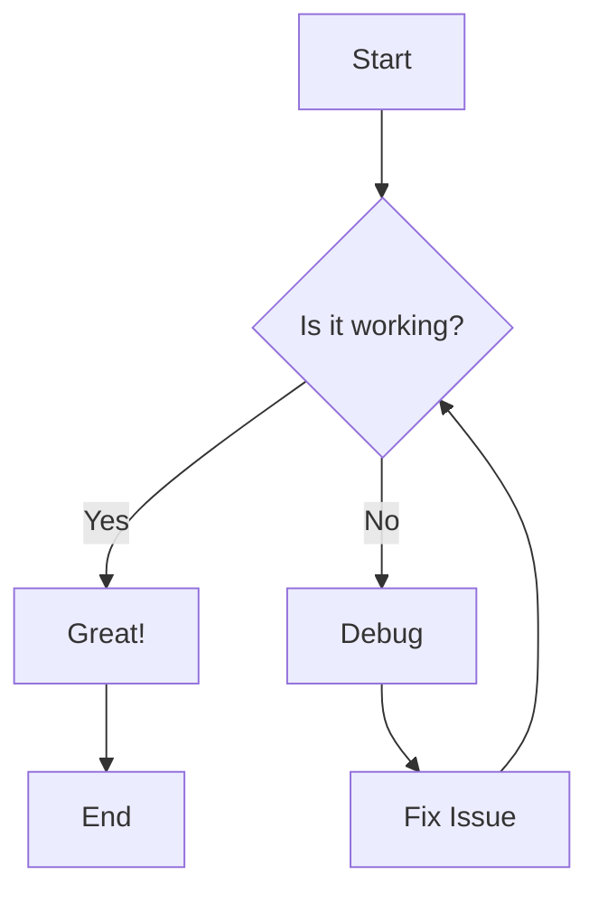
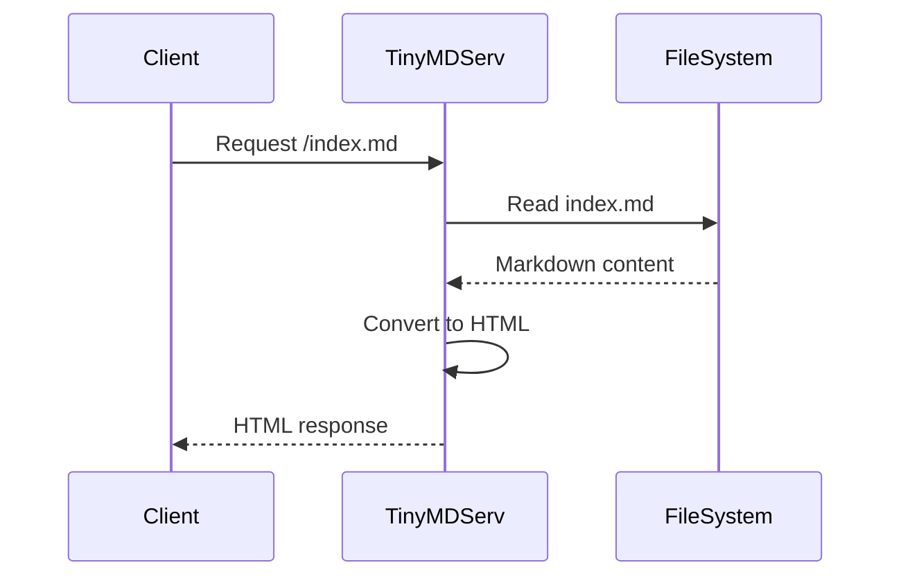
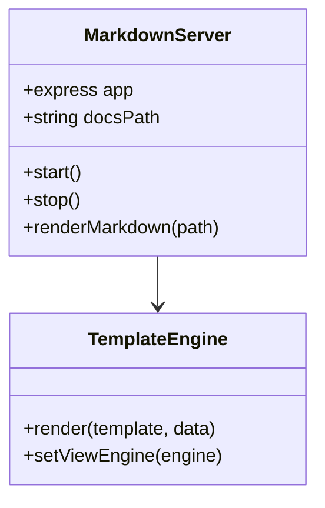

# TinyMDServ - Markdown Showcase

<!-- Search Form -->
<!-- <form action="/search">
    <input type="text" name="q" />
    <input type="submit" value="Search" />
</form> -->

TinyMDServ is a lightweight Markdown server designed for rapid deployment of Markdown-based documentation. It allows you to host your Markdown files with minimal configuration and includes simple templating capabilities.

This page demonstrates various Markdown syntax elements and how they render with TinyMDServ.

---

## Table of Contents

- [Headers](#headers)
- [Text Formatting](#text-formatting)
- [Lists](#lists)
- [Links and References](#links-and-references)
- [Images](#images)
- [Code and Syntax Highlighting](#code-and-syntax-highlighting)
- [Tables](#tables)
- [Blockquotes](#blockquotes)
- [Math Expressions](#math-expressions)
- [Diagrams with Mermaid](#diagrams-with-mermaid)
- [HTML Elements](#html-elements)
- [Special Characters](#special-characters)

---

## Headers

### Header 3 (H3)

#### Header 4 (H4)

##### Header 5 (H5)

###### Header 6 (H6)

---

## Text Formatting

### Basic Text Styles

This is **bold text** using asterisks.
This is __bold text__ using underscores.

This is *italic text* using asterisks.
This is _italic text_ using underscores.

This is ***bold and italic*** text.
This is ___bold and italic___ text.

This is ~~strikethrough~~ text.

This is ==highlighted== text (if supported).

### Line Breaks and Paragraphs

This is a paragraph with a  
line break using two spaces.

This is another paragraph.

### Special Text Elements

This is `inline code` text.

This is a <kbd>Ctrl</kbd> + <kbd>C</kbd> keyboard shortcut.

This text has a footnote reference[^1].

[^1]: This is the footnote text.

---

## Lists

### Unordered Lists

- First level item
  - Second level item
    - Third level item
    - Another third level item
  - Another second level item
- Another first level item

Alternative syntax:

* Item with asterisk
+ Item with plus
- Item with hyphen

### Ordered Lists

1. First numbered item
2. Second numbered item
   1. Nested numbered item
   2. Another nested item
      1. Deep nested item
3. Third numbered item

### Task Lists

- [x] Completed task
- [ ] Incomplete task
- [x] ~~Cancelled task~~
- [ ] Task with **bold** text

### Definition Lists

Term 1
: Definition for term 1

Term 2
: Definition for term 2
: Another definition for term 2

---

## Links and References

### Basic Links

[External link to Google](https://www.google.com)

[Link with title](https://www.example.com "This is a title")

### Reference Links

This is a [reference link][ref1] and this is [another reference][ref2].

[ref1]: https://www.example.com "Reference 1"
[ref2]: https://www.example.com "Reference 2"

### Internal Links

[Link to subdirectory](subdir)
[Link without extension](subdir/index)
[Link with .md extension](subdir/index.md)

### Automatic Links

<https://www.example.com>
<mailto:test@example.com>

---

## Images

### Basic Image


### Image with Title


### Reference Image

![Reference image][img1]

[img1]: https://via.placeholder.com/350x100?text=Reference+Image "Reference Image"

### Image with Caption


<figcaption>Figure 1: Sample chart showing data visualization</figcaption>

---

## Code and Syntax Highlighting

### Inline Code

Use the `console.log()` function to output text.
The `<article>` tag is used for main content.

### Code Blocks

#### JavaScript

```javascript
import express from 'express';
import { marked } from 'marked';

const app = express();
const port = 3000;

app.get('/', (req, res) => {
    const markdown = '# Hello World\nThis is **markdown**.';
    const html = marked(markdown);
    res.send(html);
});

app.listen(port, () => {
    console.log(`Server running on port ${port}`);
});
```

#### Python

```python
def fibonacci(n):
    """Generate Fibonacci sequence up to n terms."""
    if n <= 0:
        return []
    elif n == 1:
        return [0]
    elif n == 2:
        return [0, 1]
    
    sequence = [0, 1]
    for i in range(2, n):
        sequence.append(sequence[i-1] + sequence[i-2])
    
    return sequence

# Example usage
print(fibonacci(10))
```

#### CSS

```css
:root {
    --primary-color: #4051b5;
    --secondary-color: #526cfe;
}

article {
    max-width: 7.4in;
    margin: 1em auto;
    padding: 0 1em;
}

code {
    background-color: cornsilk;
    border-radius: 0.2rem;
    padding: 0.1em 0.3em;
}
```

#### Plain Text

```text
This is plain text without syntax highlighting.
It preserves formatting and spacing.

    Indented text
        More indented text
```

#### Shell/Bash

```bash
#!/bin/bash

# Install TinyMDServ
npm install -g tinymdserv

# Start the server
tinymdserv --port 8080 --dir ./docs

# Check if server is running
curl http://localhost:8080
```

---

## Tables

### Basic Table

| Header 1 | Header 2 | Header 3 | Header 4 |
|----------|----------|----------|----------|
| Cell 1   | Cell 2   | Cell 3   | Cell 4   |
| Cell A   | Cell B   | Cell C   | Cell D   |

### Table with Alignment

| Left Aligned | Center Aligned | Right Aligned |
|:-------------|:--------------:|--------------:|
| Left         | Center         | Right         |
| Text         | Text           | Text          |
| Data         | Data           | Data          |

### Complex Table with Formatting

<figcaption>Table 1: Feature comparison</figcaption>

| Feature | TinyMDServ | Alternative 1 | Alternative 2 |
|---------|------------|---------------|---------------|
| **Size** | ~50KB | ~200KB | ~1MB |
| **Setup** | `npm install` | Complex | Complex |
| **Speed** | ⚡ Fast | 🐢 Slow | 🚀 Very Fast |
| **Cost** | ✅ Free | ❌ Paid | ✅ Free |

---

## Blockquotes

### Simple Blockquote

> This is a simple blockquote.
> It can span multiple lines.

### Nested Blockquotes

> This is the first level of quoting.
>
> > This is a nested blockquote.
> > It's indented further.
>
> Back to the first level.

### Blockquote with Attribution

> The best way to predict the future is to invent it.
>
> — Alan Kay

### Blockquote with Formatting

> **Note:** This is an important message.
>
> You can use *formatting* within blockquotes:
> - Lists work too
> - `Code snippets` are supported
> - Even [links](https://example.com) work

---

## Math Expressions

### Inline Math

The quadratic formula is $x = \frac{-b \pm \sqrt{b^2-4ac}}{2a}$.

The area of a circle is $A = \pi r^2$.

### Block Math

$$
\int_{-\infty}^{\infty} e^{-x^2} dx = \sqrt{\pi}
$$

$$
\begin{pmatrix}
a & b \\
c & d
\end{pmatrix}
\begin{pmatrix}
x \\
y
\end{pmatrix} =
\begin{pmatrix}
ax + by \\
cx + dy
\end{pmatrix}
$$

### Complex Math Example

$$
\sum_{n=1}^{\infty} \frac{1}{n^2} = \frac{\pi^2}{6} \tag{Basel Problem}
$$

$$
f(x) = \begin{cases}
x^2 & \text{if } x \geq 0 \\
-x^2 & \text{if } x < 0
\end{cases}
$$

---

## Diagrams with Mermaid

### Flowchart



### Sequence Diagram



### Class Diagram



---

## HTML Elements

### Raw HTML

You can use <em>raw HTML</em> within Markdown.

<div style="background-color: #f0f8ff; padding: 1em; border-radius: 0.5em; border-left: 4px solid #0066cc;">
    <strong>Info:</strong> This is a custom HTML block with styling.
</div>

### Details and Summary

<details>
<summary>Click to expand</summary>

This content is hidden by default and can be expanded by clicking the summary.

```javascript
console.log("Hidden code!");
```

</details>

---

## Special Characters

### Escape Characters

\*This text is not italic\*
\`This is not code\`
\# This is not a header

### Unicode and Symbols

- Arrows: ← ↑ → ↓ ↔ ↕
- Math: ∞ ≈ ≠ ≤ ≥ ± ∑ ∏ ∫
- Symbols: © ® ™ § ¶ † ‡ • ‰
- Emojis: 🚀 ⚡ 🎉 💡 🔥 ✨ 🎯 🏆

### Line Breaks and Separators

Horizontal rules can be created with:

---

***

___

- - -

* * *

_ _ _

---

## Conclusion

This document showcases the wide range of Markdown syntax supported by TinyMDServ. From basic text formatting to complex diagrams and mathematical expressions, TinyMDServ provides a robust platform for documentation and content creation.

### Key Features Demonstrated

1. ✅ Complete Markdown syntax support
2. ✅ Math expressions with MathJax
3. ✅ Mermaid diagrams
4. ✅ Syntax highlighting
5. ✅ HTML integration
6. ✅ Table support with captions
7. ✅ Responsive design

---

*Last updated: 2025*

**TinyMDServ** - Simple, Fast, Effective Markdown Server
