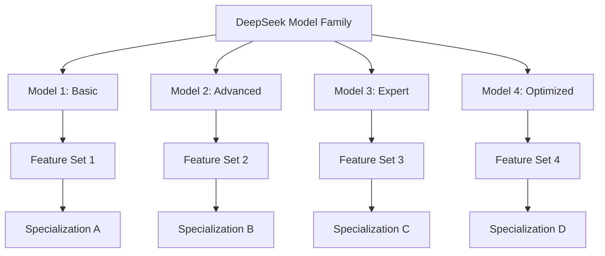

# Tiny Markdown Server

<!-- <form action="/search">
    <input type="text" name="q" />
    <input type="submit" value="Search" />
</form> -->

TinyMDServ is a lightweight Markdown server designed for rapid deployment of Markdown-based documentation.
It allows you to host your Markdown files with minimal configuration and includes simple templating capabilities.

TinyMDServ is a lightweight Markdown server designed for rapid deployment of Markdown-based documentation.
It allows you to host your Markdown files with minimal configuration and includes simple templating capabilities.

TinyMDServ is a lightweight Markdown server designed for rapid deployment of Markdown-based documentation.
It allows you to host your Markdown files with minimal configuration and includes simple templating capabilities.

TinyMDServ is a lightweight Markdown server designed for rapid deployment of Markdown-based documentation.
It allows you to host your Markdown files with minimal configuration and includes simple templating capabilities.

## Header 2

- This is level 1
  - This is level 2
    - This is level 3
    - This is level 3

### Header 3

- This is level 1
  - This is level 2
    - This is level 3
    - This is level 3

#### Header 4

- This is level 1
  - This is level 2
    - This is level 3
    - This is level 3

##### Header 5

- This is level 1
  - This is level 2
    - This is level 3
    - This is level 3

##### Header 6

- This is level 1
  - This is level 2
    - This is level 3
    - This is level 3

## Text

- This is *emphasis*, **bold**, ***emphasis with bold***.
- This is _emphasis_, __bold__, ___emphasis with bold___.

## Links

- [Subdir](subdir)
- [Subdir without postfix](subdir/index)
- [Subdir with full name](subdir/index.md)

## Mathjax

- Math expression:

$$
1 \over \pi \tag{1}
$$

$$
x_i + y_j = a_i + b_j
$$

- Inline math: $1 \over 2$.

## Code Block

- Code

```javascript
import express from 'express';

const app = express();

app.listen(port, () => {
    console.log(`Now listening on port ${port}`);
});
```

- Text

```text
import express from 'express';

const app = express();

app.listen(port, () => {
    console.log(`Now listening on port ${port}`);
});
```

- Inline code: `ENTER`.

## Table

<figcaption>Table Caption</figcaption>

| Header 1 | Header 2 | Header 3 | Header 4 | Header 5 |
| -------- | -------- | -------- | -------- | -------- |
| Text 1   | Text 2   | Text 3   | Text 4   | Text 5   |
| Text 1   | Text 2   | Text 3   | Text 4   | Text 5   |

<figcaption>Figure Caption</figcaption>

## Mermaid Example


